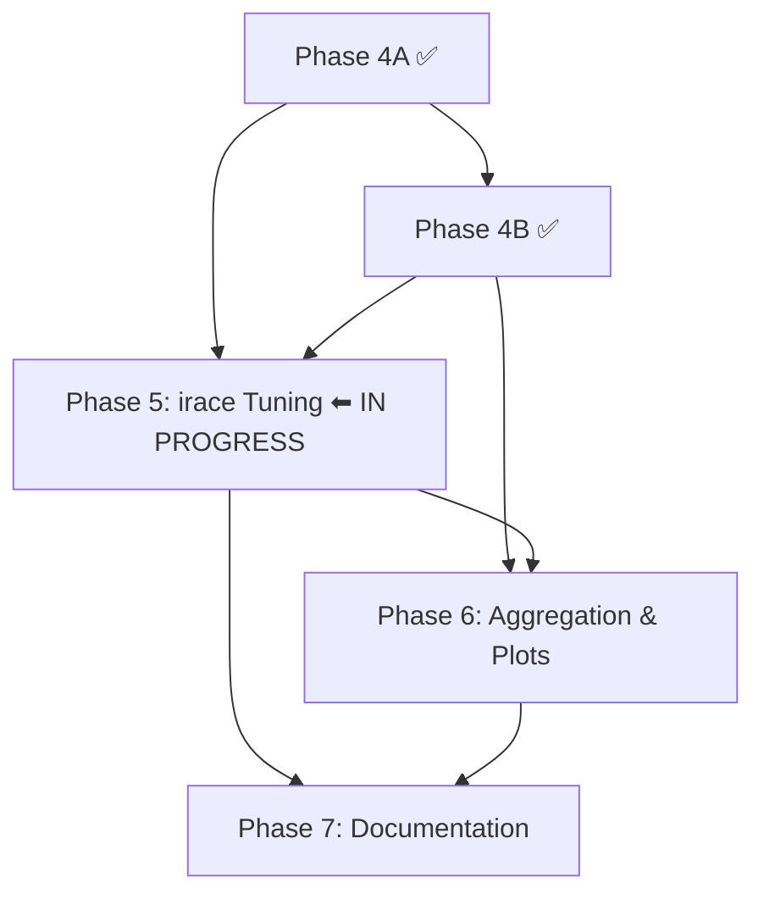

# Implementation Plan: Multi-Instance IBOVESPA Experiments for `mopop`

## Goal

Extend `mopop` from its current single-instance setup into a reproducible
10-instance experimentation pipeline (`ibov_2011`–`ibov_2020`), with correct
solvers, `irace` tuning, and multi-instance result analysis. Mirror the proven
patterns from `motsp_irace`.

---

## Decisions

| Decision | Value |
|---|---|
| Algorithms | NSGA-II, NSPSO, MOEA/D-DE, MHACO, IHS, NS-BRKGA |
| Seeds | 10: 305089489, 511812191, 608055156, 467424509, 944441939, 414977408, 819312498, 562386085, 287613914, 755772793 |
| Tuning time limit | 60 s per candidate |
| Final-run time limit | 3600 s |
| Instances | `ibov_2011`–`ibov_2020` (10 rolling windows) |
| Training window | 5 calendar years |
| OOS window | Following calendar year |
| Ticker source | `ibovespa_tickers_2011_2025/tickers_{year}.csv` |
| Statistics | Daily (no annualization) |
| irace train split | `ibov_2011`–`ibov_2017` (7 instances) |
| irace holdout split | `ibov_2018`–`ibov_2020` (3 instances) |
| Population size factor | `population_size = factor × 4` (same as `motsp_irace`) |

### Why 10 instances from 15 years of ticker data

`ibovespa_tickers_2011_2025/` contains 15 files (`tickers_2011.csv` through
`tickers_2025.csv`). The rolling-window design uses `tickers_{year}.csv` as
the IBOVESPA composition, trains on `[year, year+5)`, and validates OOS on
`[year+5, year+6)`. Instance `ibov_2020` trains on `[2020, 2025)` with OOS
`[2025, 2026)`. Instances `ibov_2021` through `ibov_2025` would require price
data extending to 2027–2031, which does not exist. The 10-instance design is
therefore the maximum the data supports, not an arbitrary choice. The extra
ticker files (`tickers_2021.csv`–`tickers_2025.csv`) serve only as
documentation of IBOVESPA composition history.

---

## Completed Work

### Phase 2 — Instance Generation ✅

`scripts/generate_instances.py` and `scripts/validate_instances.py` exist. All
ten instances (`instances/ibov_2011/` through `instances/ibov_2020/`) build from
committed cache and validate. Each instance has `train/` and `oos/`
subdirectories with `expected_returns.csv` and `covariance_matrix.csv`, plus
`metadata.json` and `tickers.csv`. Instances are 28–47 assets; 65 of 165 unique
tickers are unavailable at Yahoo Finance. A rebuild from cache inside an
isolated network namespace (`unshare -rn`) is byte-identical.

### Phase 3 — Metric Bug Fixes and Renaming ✅

Four bugs fixed, executables renamed:

| Bug | Fix |
|---|---|
| BUG 1: `hv.compute(reference_point)` | → `hv.compute(reference_point_prime)` |
| BUG 2: Reference point used `max` for all objectives | Tracks worst per sense |
| BUG 3: 5% front perturbation sign-unsafe | Removed; pads reference *point* 5% of attained range |
| BUG 4: Docstrings say "annualized" | Resolved by deleting `downloader.py` |

Three metric executables renamed: `hypervolume_ratio_calculator_exec` (HVR),
`normalized_modified_generational_distance_calculator_exec` (NIGD+),
`hypervolume_calculator_exec` (raw HV for irace). CLI flags renamed to
`--hvr-*` and `--nigd-plus-*`. Hardcoded `4` eliminated from metric execs.
`metrics_test.cpp` pins formulas to analytic values. `run.sh` flags updated.

### IBOVESPA Ticker Data ✅

`ibovespa_tickers_2011_2025/` contains `tickers_{2011..2025}.csv` plus
`manifest.json`. `cache/prices/` is committed (165 ticker CSVs). This data is
the sole input to `generate_instances.py build` and must not be re-fetched.

### Phase 4A — BUG 5, Population Initialization ✅

The seeding block added in `6b6aa16` was duplicated across all six
`*_solver.cpp` files and had two compounding defects: the index vector was
*sized* to `num_assets` and then `push_back`ed onto (leaving `num_assets`
phantom entries all pointing at asset 0), and the prefix portfolios divided raw
expected returns by a running sum that the repeated phantom contributions of
`expected_returns[0]` could drive negative. Chromosome entries then fell outside
`[0, 1]`, which normalization cannot repair — measured before the fix on
`ibov_2020/train` (NS-BRKGA, seed 305089489, 5 s): **67/100 archived solutions
with negative entropy, 61/100 with variance above the largest single-asset
variance**, extreme values reaching variance `2.9e8`.

**Fix.** The block now lives once in `Solver::build_initial_chromosomes(unsigned
max_num_chromosomes)` (`src/solver/solver.{hpp,cpp}`); all six solvers call it.
The index vector is built empty with `reserve`, only strictly positive expected
returns are selected (which makes the normalizing sum positive by construction),
and the helper stops emitting once it holds `max_num_chromosomes` entries.

That cap also closes two latent sizing hazards found while fixing this: the five
pagmo solvers computed their random-individual count as
`population_size - (2*num_assets + k - 1)` in unsigned arithmetic (underflow to
a huge `size_type` when the seeds outnumber the population) and NS-BRKGA's
`setInitialPopulations` would throw when the seed vector was larger than
`population_size`. Both matter for Phase 5, where `population_size = factor × 4`
can be far below the ~122 seeds a 47-asset instance produces.

`value[2]` (the Sharpe ratio) is now guarded against `0.0 / 0.0` in both
`src/solution/solution.cpp` and `src/solver/nsbrkga/decoder.cpp`.

**Empty portfolios.** Both decode paths previously skipped normalization when
the weights summed to zero, leaving an all-zero weight vector. Verification
found one such empty portfolio in the archive of all ten NS-BRKGA runs (and no
pagmo run): with zero variance and zero entropy it attains the global minimum of
both MINIMIZE objectives, so nothing can dominate it and it holds an archive
slot permanently, biasing the reference front and hypervolume. Both decode paths
now fall back to the **uniform portfolio** when `total_weight <= 0`, so every
decoded solution is a valid portfolio whose weights sum to 1;
`assert_solver_invariants` asserts that sum. After the change: 0 empty
portfolios across all six solvers × all ten instances.

**Regression tests.** `src/test/solver_invariants.hpp` holds the shared
assertions (all objective values finite, entropy ≥ 0, variance ≤ largest
single-asset variance, `is_feasible()`), applied by all six solver tests to
three instances each: the legacy `input/` fixture, a new committed adversarial
fixture, and `instances/ibov_2020/train/` when it has been built (guarded by a
file-existence check, since `instances/` is gitignored).

`input/{expected_returns,covariance_matrix}_bug5_test.csv` is a 10-asset
principal submatrix of `ibov_2020/train`, regenerable by that rule: asset 0 is
the most negative expected return, the next five most negative follow, and the
four smallest strictly positive returns close the list — which makes the pre-fix
running sum cross zero at prefix length `p + 1`. Against the pre-fix binary it
produced 95/100 solutions with negative entropy.

**Verified.** `make clean && make all` passes all 9 tests. Post-fix
`ibov_2020/train` acceptance run: 0 negative entropy, 0 variance above maximum,
0 non-finite (was 67 / 61 / 0). All six solvers × all ten instances, 2 s each:
60/60 outputs clean. NSGA-II and NS-BRKGA both run normally on `ibov_2020` at
`--population-size 16`, where the uncapped seed set would have been 122.

> [!NOTE]
> All numeric checking must force `LC_ALL=C`. This machine has
> `LC_NUMERIC=pt_BR.UTF-8`, under which `awk` parses `0.001511` as `0` — an
> earlier pass of this verification silently produced vacuous results. The
> checks above were redone in Python, whose `float()` is locale-independent.

Existing single-instance results are not reproducible after this change (the
seed set and hence the RNG stream both shifted). Expected and accepted — those
results were computed from broken initialization.

### Phase 4B — Multi-Instance Run Script ✅

Commit `7484d10` ("refactor: consolidate plotter logic into utility modules and
standardize snapshot plotting pipelines") completed this phase. Verified from
repository state:

- **`run.sh`** rewritten with `for instance in ${instances[@]}` loop, 10 seeds,
  renamed directories (`hvr/`, `nigd_plus/`), per-instance reference front/point
  computation, `{instance}_{solver}_{seed}` filename pattern. Instances
  configurable via `MOPOP_INSTANCES` env var.
- **`run_smoke.sh`** created: reduced profile using env vars.
- **`plotter_definitions.py`** updated: `instances` list from env, 10 seeds.
- **All plotters updated**: `plotter_hypervolume.py` → `plotter_hvr.py`,
  `plotter_igd_plus.py` → `plotter_nigd_plus.py`, instance loops added,
  `plotter_utils.py` and `plotter_counts.py` extracted as shared modules.
- **`plotter_num_fronts_snapshots copy.py`** deleted.
- **`.gitignore`** updated: covers all generated directories (`hvr/`,
  `nigd_plus/`, `statistics/`, `pareto/`, snapshots, `log_*.txt`).

**Validated:** `run_smoke.sh` completes end-to-end on 2 instances with exit 0
and no warnings; output files follow the naming convention; no references to old
directory names remain; `populations_snapshots/*.mp4` builds correctly.

---

## Phase 5 — `irace` Parameter Tuning

**Status:** In progress. Shared infrastructure (tasks 1–3) is done and the NSGA-II
workflow (tasks 4–6) is done and validated. The other five single-stage solvers and
the NS-BRKGA stages remain.

**Objective:** Set up `irace` workflows for all 6 solvers.

**Depends on:** Phase 4A ✅, Phase 4B ✅.

### Key difference from `motsp_irace`

`motsp_irace`'s target runners use `--instance <path>` (single file) and the
raw HV exec derives its reference point from `instance.primal_bound`. In
`mopop`, each solver takes two instance files (`--expected-returns-filename` and
`--covariance-filename`) and the raw HV exec reads its reference point from a
file (`--reference-point`). The target runners must:

1. Parse `$4` as an instance path (e.g., `../instances/ibov_2015`).
2. Map it to `${4}/train/expected_returns.csv` and
   `${4}/train/covariance_matrix.csv`.
3. Pass `--reference-point ${4}/reference_point.txt` to the HV calculator.

### Prerequisite: frozen reference points for tuning instances

Before irace can run, each instance needs a **frozen** reference point.
Compute it once from a pilot pool (all 6 solvers × 2 seeds × 60 s) and store it
as `instances/${instance}/reference_point.txt`. The point must not be recomputed
per candidate, or costs become incomparable. The 5%-of-range padding ensures
that a later run slightly exceeding the pilot pool still lands inside the
dominated region.

**All ten instances need one, not just the seven training instances.** The scenario
files set `testInstancesFile` with `testNbElites = 5`, so irace runs a testing phase
on `ibov_2018`–`ibov_2020` after the race; without a reference point there the target
runner's guard fires and every elite scores `Inf`. This was observed in the NSGA-II
validation before the holdout points were built. Freezing a reference point for a
holdout instance does not leak tuning signal — it is a normalization constant, and
the race itself never sees those instances.

### Directory structure

```
irace/
├── train-instances.txt         (ibov_2011 .. ibov_2017, one per line)
├── test-instances.txt          (ibov_2018 .. ibov_2020, one per line)
├── nsga2-parameters.txt
├── nsga2-scenario.txt
├── nsga2-tunner.sh
├── nspso-parameters.txt
├── nspso-scenario.txt
├── nspso-tunner.sh
├── moead-parameters.txt
├── moead-scenario.txt
├── moead-tunner.sh
├── mhaco-parameters.txt
├── mhaco-scenario.txt
├── mhaco-tunner.sh
├── ihs-parameters.txt
├── ihs-scenario.txt
├── ihs-tunner.sh
├── nsbrkga-parameters-stage{1..6}.txt
├── nsbrkga-scenario-stage{1..6}.txt
├── nsbrkga-tunner-stage{1..6}.sh
└── irace_runner.sh
```

### Instance files

**`train-instances.txt`:**
```
ibov_2011
ibov_2012
ibov_2013
ibov_2014
ibov_2015
ibov_2016
ibov_2017
```

**`test-instances.txt`:**
```
ibov_2018
ibov_2019
ibov_2020
```

### Scenario files (example: `nsga2-scenario.txt`)

```
execDir = "./"
trainInstancesDir = "../instances"
trainInstancesFile = "./train-instances.txt"
targetRunner = "./nsga2-tunner.sh"
maxTime = 144000
parallel = 1
logFile = "./irace-nsga2.Rdata"
parameterFile = "./nsga2-parameters.txt"
testInstancesDir = "../instances"
testInstancesFile = "./test-instances.txt"
testNbElites = 5
testIterationElites = 0
```

> [!NOTE]
> `trainInstancesDir = "../instances"` means irace passes
> `../instances/ibov_2015` as `$4`. The target runner appends
> `/train/expected_returns.csv` and `/train/covariance_matrix.csv`.

> [!NOTE]
> `maxTime = 144000` is 2400 evaluations at the 60 s per-evaluation limit — the same
> tuning effort `motsp_irace` bought with `2160000`, where an evaluation was 900 s.
> Carrying `2160000` over literally would mean 36,000 evaluations, about 25 days
> serial. `boundMax` is deliberately left unset, which keeps irace's capping off
> (`checkScenario` only enables capping when `boundMax > 0`).

### Target runner contract (all solvers)

Each `{solver}-tunner.sh` must:
1. Parse: `$1`=config_id, `$2`=instance_id, `$3`=seed, `$4`=instance_path.
2. Set `export LC_ALL=C` (not just `LC_NUMERIC` — the elapsed time and the
   hypervolume negation both go through `awk`).
3. Resolve `$4` to an absolute path, then derive
   `ER=${4}/train/expected_returns.csv`, `COV=${4}/train/covariance_matrix.csv`,
   `REF=${4}/reference_point.txt`. Resolving matters because everything else in the
   script is absolute and irace invokes the runner from `execDir`.
4. Run solver for `${MOPOP_IRACE_TIME_LIMIT:-60}` s with `--pareto` output to tmpdir.
   The override exists so a budget smoke can run many evaluations quickly; tuning
   runs use the default.
5. For pagmo solvers: `population_size = population_size_factor × 4`.
6. Compute raw HV: `hypervolume_calculator_exec --expected-returns-filename $ER
   --covariance-filename $COV --reference-point $REF --pareto-0 $PARETO_FILE
   --hypervolume-0 $HV_FILE`.
7. Print `cost elapsed_time` where `cost = -HV` (negated, since irace
   minimizes) or `Inf` on failure.
8. Clean tmpdir via `trap`.

> [!IMPORTANT]
> **Test every artefact with `[ -s ]`, never `[ -f ]`.** `motsp_irace`'s runners check
> existence only, which is not enough here: `hypervolume_calculator_exec` opens its
> output file *before* computing
> ([hypervolume_calculator_exec.cpp:178](file:///home/luishpmendes/mopop/src/exec/hypervolume_calculator_exec.cpp)),
> and pagmo throws when a front point fails to dominate the reference point — so a
> failure leaves the file present but empty. The solver likewise writes an empty
> `--pareto` file when its archive is empty, and any exec handed a bad flag prints
> its usage string and exits 0. The final HV value is also regex-checked as a number
> before negation.

### Parameter files

Derive from actual solver CLI flags (verified from `*_solver_exec.cpp`):

| Solver | Parameters |
|---|---|
| **NSGA-II** | `population_size_factor` i(25,125), `crossover_probability` r(0.01,0.99), `crossover_distribution` r(1,99), `mutation_probability` r(0.01,0.99), `mutation_distribution` r(1,99) |
| **NSPSO** | `population_size_factor` i(25,125), `omega` r(0,1), `v_coeff` r(0,1), `chi` r(0,1), `v_max` r(0,1), `u_min` r(0,1), `u_max` r(0,1), `memory` c(0,1) |
| **MOEA/D-DE** | `population_size_factor` i(25,125), `weight_generation` c(grid,low_discrepancy,random), `decomposition` c(tchebycheff,weighted,bi), `cr` r(0,1), `f` r(0,2), `neighbours` i(2,50), `preserve_diversity` c(0,1) |
| **MHACO** | `population_size_factor` i(25,125), `ker` i(2,100), `q` r(0.01,100), `threshold` i(1,100), `n_gen_mark` i(1,100), `focus` r(0,1), `memory` c(0,1) |
| **IHS** | `population_size_factor` i(25,125), `phmcr` r(0.01,0.99), `ppar_min` r(0.01,0.99), `ppar_max` r(0.01,0.99), `bw_min` r(1e-6,1), `bw_max` r(1e-6,1) |
| **NS-BRKGA** | 6-stage ablation (identical structure to `motsp_irace`) |

### NS-BRKGA staged ablation

Six stages, each unlocking one feature group while fixing the rest. Matches
`motsp_irace/irace/nsbrkga-parameters-stage{1..6}.txt` exactly in structure:

| Stage | Unlocks | Fixed at |
|---|---|---|
| 1 | Core GA params (pop size, elites, mutation, bias, crossover) | 1 pop, no exchange/PR/shake/reset, diversity=NONE |
| 2 | Dynamic elite sizing + diversity type | Still single pop, no exchange/PR/shake/reset |
| 3 | Multiple populations + exchange | No PR/shake/reset |
| 4 | Path relinking (type, dist func, percentage, interval) | No shake/reset |
| 5 | Shaking (interval, intensity, distribution) | No reset |
| 6 | Reset (interval, intensity, distribution) — full NS-BRKGA | All unlocked |

Each stage has its own `nsbrkga-parameters-stageN.txt`,
`nsbrkga-scenario-stageN.txt`, and `nsbrkga-tunner-stageN.sh`. The tunner
scripts are identical except for the stage number in log/Rdata filenames.

Forbidden parameter combinations (from `motsp_irace`):
- `min_elites_percentage >= max_elites_percentage`
- `num_elite_parents > num_total_parents`
- `num_populations * num_exchange_individuals >= population_size_factor * 4`
- `num_elite_parents > (population_size_factor * 4) * min_elites_percentage`

### Tasks

1. ✅ Create `irace/train-instances.txt` and `irace/test-instances.txt`.
2. ✅ Create `scripts/build_pilot_reference_points.sh`: runs all 6 solvers ×
   2 seeds × 60 s on each instance, pools results per instance,
   computes reference front and reference point using
   `reference_pareto_front_and_point_calculator_exec`, writes
   `instances/${instance}/reference_point.txt`. Refuses to overwrite a frozen
   point without `--force`; scale comes from `MOPOP_PILOT_*` env vars.
3. ✅ Run the pilot to generate frozen reference points. Done for **all ten**
   instances, `ibov_2011`–`ibov_2020` — the holdout three are needed by irace's
   testing phase (see the prerequisite section above).
4. Create parameter files for each of the 5 single-stage solvers. — ✅ NSGA-II;
   nspso, moead, mhaco, ihs open.
5. Create scenario files for each of the 5 single-stage solvers. — ✅ NSGA-II;
   nspso, moead, mhaco, ihs open.
6. Create target runner (`*-tunner.sh`) for each of the 5 single-stage solvers. —
   ✅ NSGA-II; nspso, moead, mhaco, ihs open.
7. Create NS-BRKGA staged parameter files (6 stages).
8. Create NS-BRKGA staged scenario files (6 stages).
9. Create NS-BRKGA staged target runners (6 stages).
10. Create `irace/irace_runner.sh` orchestrator.

### Acceptance criteria

- Every target runner passes `irace --check`. — ✅ NSGA-II.
- Budget smoke test completes for each solver. — ✅ NSGA-II (179 experiments,
  6 iterations, 4 elites, every training cost finite).
- stdout contains only `cost elapsed_time` (no debug output). — ✅ NSGA-II.
- Holdout instances untouched during tuning. — ✅ the race draws only from
  `train-instances.txt`; the holdout is read solely in the post-race testing phase.
- `instances/ibov_{2011..2020}/reference_point.txt` exist and contain exactly
  4 space-separated floats. — ✅ all ten.

### Validation commands

```bash
# Freeze the reference points (once, before any tuning)
./scripts/build_pilot_reference_points.sh                       # ibov_2011..2017
MOPOP_PILOT_INSTANCES="ibov_2018 ibov_2019 ibov_2020" \
  ./scripts/build_pilot_reference_points.sh                     # holdout

# Verify reference points
for y in $(seq 2011 2020); do
  wc -w < instances/ibov_${y}/reference_point.txt  # expect: 4
done

# The irace launcher is not on PATH; the R package is installed.
IRACE=~/R/x86_64-pc-linux-gnu-library/4.1/irace/bin/irace

# Target runner standalone — stdout must be exactly "cost elapsed"
cd irace
MOPOP_IRACE_TIME_LIMIT=5 ./nsga2-tunner.sh 1 1 12345 ../instances/ibov_2011 \
  --population-size-factor 25 --crossover-probability 0.95 \
  --crossover-distribution 10 --mutation-probability 0.01 --mutation-distribution 50

# Check a single runner
$IRACE --check --scenario nsga2-scenario.txt

# Budget smoke. 180 is irace's minimum for a 5-parameter scenario, not an
# arbitrary number: checkMinimumBudget requires
#   (minSurvival+1) * nbIterations * (mu + eachTest + (nbIterations-1)*max(eachTest,Tnew))
# and nbIterations = minSurvival = floor(2 + log2 5) = 4, giving 5*4*(5+1+3) = 180.
# --max-time 0 is required: irace rejects two positive budgets.
# Note the CLI switches are kebab-case (--max-time, --max-experiments, --log-file),
# not the R argument names (maxTime, maxExperiments, logFile).
MOPOP_IRACE_TIME_LIMIT=3 $IRACE --scenario nsga2-scenario.txt \
  --max-time 0 --max-experiments 180 --log-file ./smoke-nsga2.Rdata
rm -f ./smoke-nsga2.Rdata
```

### Risks

- ~~Pilot pool may not cover the full attained range → later irace candidates
  produce fronts outside the reference point.~~ Retired: all 179 evaluations of the
  NSGA-II smoke returned finite costs, including 3-second runs far worse than the
  60-second pilot. The per-objective extremes come from the deterministic seed
  chromosomes that `Solver::build_initial_chromosomes` gives every run, so the pooled
  bounds are stable across configurations, and
  `reference_pareto_front_and_point_calculator_exec` widens them using every pooled
  point rather than only the surviving front.
- `irace` R package must be installed (`install.packages("irace")`). Present: 4.3.
- **The frozen reference points are not under version control.** `.gitignore` line 8
  ignores `instances/`, so `reference_point.txt` is ignored with it and "frozen"
  currently holds only on this machine. Re-running the pilot elsewhere produces
  different points and silently invalidates comparisons against tuning already done.
  Fixing it needs the four-line un-ignore form, since a file inside an ignored
  directory cannot be re-included on its own — tracked as a Phase 7 item.

---

## Phase 6 — Result Aggregation, Statistics, and Plotting

**Status:** Not started.

**Objective:** Aggregate multi-instance results, compute statistics, generate
publication-quality plots.

**Depends on:** Phase 4B ✅, Phase 5 (tuned parameters used in final runs).

### Files to create/modify

#### [NEW] `scripts/results_aggregator.py`

Mirror [motsp_irace/results_aggregator.py](file:///home/luishpmendes/UNICAMP/Doutorado/motsp_irace/results_aggregator.py):

- Read HVR from `hvr/{instance}_{solver}_{seed}.txt` (one float per file).
- Read NIGD+ from `nigd_plus/{instance}_{solver}_{seed}.txt`.
- Read snapshots from `hvr_snapshots/` and `nigd_plus_snapshots/`.
- Output `metrics.csv` (tidy, one row per `(instance, solver, seed, metric)`).
- Output `metrics_snapshots.csv`.
- Output per-metric stats: `hvr_stats.csv`, `nigd_plus_stats.csv` with
  mean, std, rank.

#### [NEW] `scripts/metrics_stats.py`

Mirror [motsp_irace/metrics_stats.py](file:///home/luishpmendes/UNICAMP/Doutorado/motsp_irace/metrics_stats.py):

- Per-instance and all-instance mean ± std for each solver × metric.
- Print to stdout (tee to `metrics_stats.txt` in `run.sh`).

#### [MODIFY] All plotter scripts

Already handled in Phase 4B for the instance loop; this phase adds:

- Cross-instance aggregate plots (algorithm-rank boxplots).
- Convergence curves (median ± IQR) per instance.
- Pareto front plots for best/median runs per instance.

### Required plots

1. Per-instance HVR and NIGD+ boxplots (6 solvers).
2. Aggregate rank plots across all 10 instances.
3. Convergence curves (median ± IQR) per instance.
4. Pareto front plots for best/median runs per instance.

### Tasks

1. Implement `scripts/results_aggregator.py`.
2. Implement `scripts/metrics_stats.py`.
3. Wire both into `run.sh` (after the `results_aggregator_exec` block).
4. Add cross-instance aggregate plots to existing plotters.

### Acceptance criteria

- `metrics.csv` has exactly `10 × 6 × 10 × 2 = 1200` rows (600 HVR + 600
  NIGD+).
- Missing data detected and reported (non-silent).
- All plots generate headlessly (`matplotlib.use('Agg')`).
- `metrics_stats.txt` contains per-instance and aggregate tables.

---

## Phase 7 — Documentation

**Status:** Not started.

**Objective:** Complete README, ensure clean-clone reproducibility.

**Depends on:** Phases 5, 6.

### Files to modify/create

#### [MODIFY] [.gitignore](file:///home/luishpmendes/mopop/.gitignore)

Add irace outputs:
```
irace/*.Rdata
irace/*-tuning.log
irace/*-testing.log
```

Also **un-ignore the frozen reference points**. Line 8 ignores `instances/`, which
takes `instances/*/reference_point.txt` with it, so the points Phase 5 froze exist
only on the machine that ran the pilot. They are experimental constants, not
regenerable output: `scripts/generate_instances.py build` reproduces the instances
byte for byte from the committed `cache/prices/`, but a re-run pilot produces
different reference points and silently changes every hypervolume already measured
against them. Git cannot re-include a file inside an ignored directory, so line 8
has to be expanded:
```
instances/*
!instances/*/
instances/*/*
!instances/*/reference_point.txt
```

#### [MODIFY] [README.md](file:///home/luishpmendes/mopop/README.md)

Sections:
1. Problem formulation (4 objectives, mixed senses).
2. Dependencies and build (`make all` with configurable paths).
3. Python environment setup (`requirements.txt`).
4. Instance generation commands.
5. Smoke experiment command (`run_smoke.sh`).
6. Full experiment command + runtime estimate.
7. HVR and NIGD+ definitions (exact formulas).
8. `irace` tuning procedure.
9. Result aggregation and plotting commands.
10. Reproducibility notes (Yahoo Finance caveats, survivorship bias).

#### Stale file cleanup

- Verify `input/` is only used by tests; if so, document in README.

### Tasks

1. Add irace outputs to `.gitignore`.
2. Write complete README.
3. Verify clean-clone smoke execution (clone, build, `run_smoke.sh`).

### Acceptance criteria

- New user with documented dependencies can run smoke profile from clean clone.
- `.gitignore` covers all generated artifacts including irace outputs.

---

## Dependency Graph



**Critical path:** 4A ✅ → 4B ✅ → **5** → 6 → 7.

---

## Reference Projects

| Project | Path | Used for |
|---|---|---|
| `motsp_irace` | `/home/luishpmendes/UNICAMP/Doutorado/motsp_irace` | `run.sh`, irace files, `results_aggregator.py`, `metrics_stats.py` |
| `mopci` | `/home/luishpmendes/UNICAMP/Doutorado/mopci` | Additional plotter patterns |
| `motmdsp` | `/home/luishpmendes/UNICAMP/Doutorado/motmdsp` | Additional plotter patterns |

---

## Risks

| Risk | Impact | Mitigation |
|---|---|---|
| BUG 5 fix changes solver convergence | Existing results not reproducible | Expected — old results were wrong |
| `population_size_factor × 4` too small for seeded individuals | Runtime crash | Resolved in Phase 4A — cap verified at `--population-size 16` on `ibov_2020` |
| irace reference point drift | Costs incomparable across candidates | Freeze reference point from pilot pool |
| Yahoo re-adjusts prices | Cache diverges from fresh download | Cache is committed and pinned; never re-fetch |
| 100+ hours wall-clock for full run | Long feedback loop | `run_smoke.sh` for quick validation |

---

## What Was Removed from Prior Plans

1. **YAML configuration system** — unnecessary; hardcode in shell scripts.
2. **OOS portfolio reevaluation pipeline** — deferred.
3. **Atomic rename / resume / force behavior** — over-engineering.
4. **Nested `results/<experiment_id>/` structure** — use flat directories.
5. **Separate `src/metrics/` library** — keep metric logic in exec files.
6. **Multiple shell scripts (`build_reference_fronts.sh`, `compute_metrics.sh`)** — consolidated into `run.sh`.
7. **Speculative features** (training-vs-OOS degradation plots, effect-size measures).
8. **Phase 1 (Build Portability)** — `requirements.txt` exists; `make check` deferred to Phase 7.
