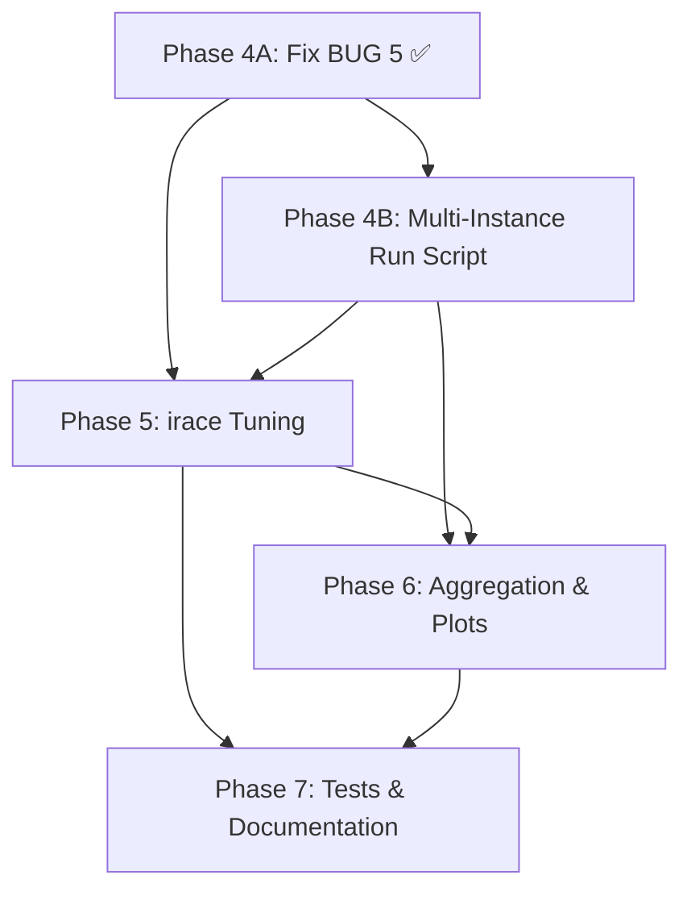

# Implementation Plan: Multi-Instance IBOVESPA Experiments for `mopop`

## Goal

Extend `mopop` from its current single-instance setup into a reproducible
10-instance experimentation pipeline (`ibov_2011`–`ibov_2020`), with correct
solvers, `irace` tuning, and multi-instance result analysis. Mirror the proven
patterns from `motsp_irace`.

---

## Decisions

| Decision | Value |
|---|---|
| Algorithms | NSGA-II, NSPSO, MOEA/D-DE, MHACO, IHS, NS-BRKGA |
| Seeds | 10: 305089489, 511812191, 608055156, 467424509, 944441939, 414977408, 819312498, 562386085, 287613914, 755772793 |
| Tuning time limit | 60 s per candidate |
| Final-run time limit | 3600 s |
| Instances | `ibov_2011`–`ibov_2020` (10 rolling windows) |
| Training window | 5 calendar years |
| OOS window | Following calendar year |
| Ticker source | `ibovespa_tickers_2011_2025/tickers_{year}.csv` |
| Statistics | Daily (no annualization) |
| irace train split | `ibov_2011`–`ibov_2017` (7 instances) |
| irace holdout split | `ibov_2018`–`ibov_2020` (3 instances) |
| Population size factor | `population_size = factor × 4` (same as `motsp_irace`) |

---

## Completed Work

### Phase 2 — Instance Generation ✅

`scripts/generate_instances.py` and `scripts/validate_instances.py` exist. All
ten instances (`instances/ibov_2011/` through `instances/ibov_2020/`) build from
committed cache and validate. Each instance has `train/` and `oos/`
subdirectories with `expected_returns.csv` and `covariance_matrix.csv`, plus
`metadata.json` and `tickers.csv`. Instances are 28–47 assets; 65 of 165 unique
tickers are unavailable at Yahoo Finance. A rebuild from cache inside an
isolated network namespace (`unshare -rn`) is byte-identical.

### Phase 3 — Metric Bug Fixes and Renaming ✅

Four bugs fixed, executables renamed:

| Bug | Fix |
|---|---|
| BUG 1: `hv.compute(reference_point)` | → `hv.compute(reference_point_prime)` |
| BUG 2: Reference point used `max` for all objectives | Tracks worst per sense |
| BUG 3: 5% front perturbation sign-unsafe | Removed; pads reference *point* 5% of attained range |
| BUG 4: Docstrings say "annualized" | Resolved by deleting `downloader.py` |

Three metric executables renamed: `hypervolume_ratio_calculator_exec` (HVR),
`normalized_modified_generational_distance_calculator_exec` (NIGD+),
`hypervolume_calculator_exec` (raw HV for irace). CLI flags renamed to
`--hvr-*` and `--nigd-plus-*`. Hardcoded `4` eliminated from metric execs.
`metrics_test.cpp` pins formulas to analytic values. `run.sh` flags updated.

### IBOVESPA Ticker Data ✅

`ibovespa_tickers_2011_2025/` contains `tickers_{2011..2025}.csv` plus
`manifest.json`. `cache/prices/` is committed (165 ticker CSVs). This data is
the sole input to `generate_instances.py build` and must not be re-fetched.

### Phase 4A — BUG 5, Population Initialization ✅

The seeding block added in `6b6aa16` was duplicated across all six
`*_solver.cpp` files and had two compounding defects: the index vector was
*sized* to `num_assets` and then `push_back`ed onto (leaving `num_assets`
phantom entries all pointing at asset 0), and the prefix portfolios divided raw
expected returns by a running sum that the repeated phantom contributions of
`expected_returns[0]` could drive negative. Chromosome entries then fell outside
`[0, 1]`, which normalization cannot repair — measured before the fix on
`ibov_2020/train` (NS-BRKGA, seed 305089489, 5 s): **67/100 archived solutions
with negative entropy, 61/100 with variance above the largest single-asset
variance**, extreme values reaching variance `2.9e8`.

**Fix.** The block now lives once in `Solver::build_initial_chromosomes(unsigned
max_num_chromosomes)` (`src/solver/solver.{hpp,cpp}`); all six solvers call it.
The index vector is built empty with `reserve`, only strictly positive expected
returns are selected (which makes the normalizing sum positive by construction),
and the helper stops emitting once it holds `max_num_chromosomes` entries.

That cap also closes two latent sizing hazards found while fixing this: the five
pagmo solvers computed their random-individual count as
`population_size - (2*num_assets + k - 1)` in unsigned arithmetic (underflow to
a huge `size_type` when the seeds outnumber the population), and NS-BRKGA's
`setInitialPopulations` *throws* when a population holds more chromosomes than
`population_size`. Both matter for Phase 5, where `population_size = factor × 4`
can be far below the ~122 seeds a 47-asset instance produces.

`value[2]` (the Sharpe ratio) is now guarded against `0.0 / 0.0` in both
`src/solution/solution.cpp` and `src/solver/nsbrkga/decoder.cpp`.

**Empty portfolios.** Both decode paths previously skipped normalization when
the weights summed to zero, leaving an all-zero weight vector. Verification
found one such empty portfolio in the archive of all ten NS-BRKGA runs (and no
pagmo run): with zero variance and zero entropy it attains the global minimum of
both MINIMIZE objectives, so nothing can dominate it and it holds an archive
slot permanently, biasing the reference front and hypervolume. It is not present
at `--iterations-limit 0` or `1`, so it is produced during evolution — NS-BRKGA's
ROULETTE crossover can draw the zero allele from each of the `num_assets`
single-asset seed chromosomes. Both decode paths now fall back to the **uniform
portfolio** when `total_weight <= 0`, so every decoded solution is a valid
portfolio whose weights sum to 1; `assert_solver_invariants` asserts that sum.
After the change: 0 empty portfolios across all six solvers × all ten instances.

**Regression tests.** `src/test/solver_invariants.hpp` holds the shared
assertions (all objective values finite, entropy ≥ 0, variance ≤ largest
single-asset variance, `is_feasible()`), applied by all six solver tests to
three instances each: the legacy `input/` fixture, a new committed adversarial
fixture, and `instances/ibov_2020/train/` when it has been built (guarded by a
file-existence check, since `instances/` is gitignored).

`input/{expected_returns,covariance_matrix}_bug5_test.csv` is a 10-asset
principal submatrix of `ibov_2020/train`, regenerable by that rule: asset 0 is
the most negative expected return, the next five most negative follow, and the
four smallest strictly positive returns close the list — which makes the pre-fix
running sum cross zero at prefix length `p + 1`. Against the pre-fix binary it
produced 95/100 solutions with negative entropy.

**Verified.** `make clean && make all` passes all 9 tests. Post-fix
`ibov_2020/train` acceptance run: 0 negative entropy, 0 variance above maximum,
0 non-finite (was 67 / 61 / 0). All six solvers × all ten instances, 2 s each:
60/60 outputs clean. NSGA-II and NS-BRKGA both run normally on `ibov_2020` at
`--population-size 16`, where the uncapped seed set would have been 122.

> [!NOTE]
> All numeric checking must force `LC_ALL=C`. This machine has
> `LC_NUMERIC=pt_BR.UTF-8`, under which `awk` parses `0.001511` as `0` — an
> earlier pass of this verification silently produced vacuous results. The
> checks above were redone in Python, whose `float()` is locale-independent.

Existing single-instance results are not reproducible after this change (the
seed set and hence the RNG stream both shifted). Expected and accepted — those
results were computed from broken initialization.

---

## Phase 4B — Multi-Instance Run Script

**Objective:** Rewrite `run.sh` to loop over instances, using `motsp_irace`'s
pattern. Rename output directories to `hvr/`, `nigd_plus/`.

**Depends on:** Phase 4A (solvers must be correct).

### Files to modify/create

#### [MODIFY] [run.sh](file:///home/luishpmendes/mopop/run.sh)

Rewrite to follow [motsp_irace/run.sh](file:///home/luishpmendes/UNICAMP/Doutorado/motsp_irace/run.sh):

- Add `set -euo pipefail`.
- Add outer `for instance in ${instances[@]}` loop.
- Use 10 seeds.
- Use renamed directories: `hvr/`, `hvr_snapshots/`, `nigd_plus/`,
  `nigd_plus_snapshots/`.
- Use `{instance}_{solver}_{seed}` filename pattern.
- Point each instance to `instances/${instance}/train/expected_returns.csv` and
  `instances/${instance}/train/covariance_matrix.csv`.
- Reference front/point computed **per instance**: `pareto/${instance}.txt` and
  `pareto/${instance}_point.txt`.
- HVR and NIGD+ computed **per instance**, reading the instance's own reference
  front and reference point.
- Results aggregator invoked **per instance per solver** using
  `{instance}_{solver}` output prefix.
- Parameters: `time_limit=3600`, `max_num_solutions=500`,
  `max_num_snapshots=30`, `max_ref_solutions=800`.

> [!IMPORTANT]
> `mopop`'s `hypervolume_ratio_calculator_exec` and
> `normalized_modified_generational_distance_calculator_exec` take
> `--reference-point` in addition to `--reference-pareto`, unlike `motsp_irace`
> which derives the reference point from `instance.primal_bound`. The run script
> must pass `--reference-point ${path}/pareto/${instance}_point.txt` to both.

#### [NEW] `run_smoke.sh`

Same structure but: 1 instance (`ibov_2015`), 2 seeds, 5 s time limit.

#### [MODIFY] [plotter_definitions.py](file:///home/luishpmendes/mopop/plotter_definitions.py)

```python
instances = ["ibov_2011", "ibov_2012", ..., "ibov_2020"]
seeds = [305089489, 511812191, ..., 755772793]  # 10 seeds
num_snapshots = 30
# Remove: expected_returns, covariance (no longer single-instance)
```

#### [MODIFY] All `plotter_*.py` files

- Add instance loop.
- Update directory names (`hypervolume` → `hvr`, `igd_plus` → `nigd_plus`).
- Update filename pattern to `{instance}_{solver}_{seed}`.
- Input file extensions are `.txt`, not `.csv` (fix existing mismatch noted in
  `plotter_definitions.py`).

### Output structure

```
mopop/
├── statistics/       ibov_2011_nsga2_305089489.txt ...
├── pareto/           ibov_2011_nsga2_305089489.txt, ibov_2011.txt, ibov_2011_point.txt ...
├── hvr/              ibov_2011_nsga2_305089489.txt ...
├── hvr_snapshots/    ibov_2011_nsga2_305089489.txt ...
├── nigd_plus/        ibov_2011_nsga2_305089489.txt ...
├── nigd_plus_snapshots/ ...
├── best_solutions_snapshots/ ...
├── num_non_dominated_snapshots/ ...
├── num_fronts_snapshots/ ...
├── num_elites_snapshots/ ...
├── populations_snapshots/ ...
├── metrics/ ...
└── metrics_snapshots/ ...
```

### Tasks

1. Rewrite `run.sh` with instance loop, 10 seeds, renamed dirs.
2. Create `run_smoke.sh`.
3. Update `plotter_definitions.py`.
4. Update all 12 `plotter_*.py` files for multi-instance.
5. Delete `plotter_num_fronts_snapshots copy.py` (stale duplicate).

### Acceptance criteria

- `run_smoke.sh` completes end-to-end on 1 instance, 2 seeds, 5 s.
- Output files follow `{instance}_{solver}_{seed}` naming.
- Reference front computed per instance (not globally).
- All 6 solvers produce non-empty pareto files.
- No file references old directory names (`hypervolume/`, `igd_plus/`).

### Runtime estimate (full run)

```
10 instances × 6 solvers × 10 seeds × 3600 s = 600 runs @ 1 hr each
With 6 workers ≈ 100 hours wall-clock
```

---

## Phase 5 — `irace` Parameter Tuning

**Objective:** Set up `irace` workflows for all 6 solvers.

**Depends on:** Phase 4A (solvers correct), Phase 4B (instances wired up).

### Key difference from `motsp_irace`

`motsp_irace`'s target runners use `--instance <path>` (single file) and the
raw HV exec derives its reference point from `instance.primal_bound`. In
`mopop`, each solver takes two instance files (`--expected-returns-filename` and
`--covariance-filename`) and the raw HV exec reads its reference point from a
file (`--reference-point`). The target runners must:

1. Parse `$4` as an instance name (e.g., `ibov_2015`).
2. Map it to `instances/${INSTANCE}/train/expected_returns.csv` and
   `instances/${INSTANCE}/train/covariance_matrix.csv`.
3. Pass `--reference-point instances/${INSTANCE}/reference_point.txt` to the HV
   calculator.

### Prerequisite: frozen reference points for tuning instances

Before irace can run, each training instance needs a **frozen** reference point.
Compute it once from a pilot pool (all 6 solvers × 2 seeds × 60 s) and store it
as `instances/${instance}/reference_point.txt`. The point must not be recomputed
per candidate, or costs become incomparable. The 5%-of-range padding ensures
that a later run slightly exceeding the pilot pool still lands inside the
dominated region.

### Directory structure

```
irace/
├── train-instances.txt         (ibov_2011 .. ibov_2017, one per line)
├── test-instances.txt          (ibov_2018 .. ibov_2020, one per line)
├── nsga2-parameters.txt
├── nsga2-scenario.txt
├── nsga2-tunner.sh
├── nspso-parameters.txt
├── nspso-scenario.txt
├── nspso-tunner.sh
├── moead-parameters.txt
├── moead-scenario.txt
├── moead-tunner.sh
├── mhaco-parameters.txt
├── mhaco-scenario.txt
├── mhaco-tunner.sh
├── ihs-parameters.txt
├── ihs-scenario.txt
├── ihs-tunner.sh
├── nsbrkga-parameters-stage{1..6}.txt
├── nsbrkga-scenario-stage{1..6}.txt
├── nsbrkga-tunner-stage{1..6}.sh
└── irace_runner.sh
```

### Instance files (matching `motsp_irace` format)

**`train-instances.txt`:**
```
ibov_2011
ibov_2012
ibov_2013
ibov_2014
ibov_2015
ibov_2016
ibov_2017
```

**`test-instances.txt`:**
```
ibov_2018
ibov_2019
ibov_2020
```

### Scenario files (example: `nsga2-scenario.txt`)

```
execDir = "./"
trainInstancesDir = "../instances"
trainInstancesFile = "./train-instances.txt"
targetRunner = "./nsga2-tunner.sh"
maxTime = 2160000
parallel = 1
logFile = "./irace-nsga2.Rdata"
parameterFile = "./nsga2-parameters.txt"
testInstancesDir = "../instances"
testInstancesFile = "./test-instances.txt"
testNbElites = 5
testIterationElites = 0
```

> [!NOTE]
> `trainInstancesDir = "../instances"` means irace passes `../instances/ibov_2015`
> as `$4`. The target runner appends `/train/expected_returns.csv` and
> `/train/covariance_matrix.csv`.

### Target runner contract (all solvers)

Each `{solver}-tunner.sh` must:
1. Parse: `$1`=config_id, `$2`=instance_id, `$3`=seed, `$4`=instance_path.
2. Derive `ER=${4}/train/expected_returns.csv`,
   `COV=${4}/train/covariance_matrix.csv`,
   `REF=${4}/reference_point.txt`.
3. Run solver for 60 s with `--pareto` output to tmpdir.
4. Compute raw HV: `hypervolume_calculator_exec --expected-returns-filename $ER
   --covariance-filename $COV --reference-point $REF --pareto-0 $PARETO_FILE
   --hypervolume-0 $HV_FILE`.
5. Print `cost elapsed_time` where `cost = -HV` (negated, since irace
   minimizes) or `Inf` on failure.
6. Clean tmpdir via `trap`.

### Parameter files

Derive from actual solver CLI flags (verified from `*_solver_exec.cpp` usage
strings):

| Solver | Parameters |
|---|---|
| **NSGA-II** | `population_size_factor` i(25,125), `crossover_probability` r(0.01,0.99), `crossover_distribution` r(1,99), `mutation_probability` r(0.01,0.99), `mutation_distribution` r(1,99) |
| **NSPSO** | `population_size_factor` i(25,125), `omega` r(0,1), `v_coeff` r(0,1), `chi` r(0,1), `v_max` r(0,1), `u_min` r(0,1), `u_max` r(0,1), `memory` c(0,1) |
| **MOEA/D-DE** | `population_size_factor` i(25,125), `weight_generation` c(grid,low_discrepancy,random), `decomposition` c(tchebycheff,weighted,bi), `cr` r(0,1), `f` r(0,2), `neighbours` i(2,50), `preserve_diversity` c(0,1) |
| **MHACO** | `population_size_factor` i(25,125), `ker` i(2,100), `q` r(0.01,100), `threshold` i(1,100), `n_gen_mark` i(1,100), `focus` r(0,1), `memory` c(0,1) |
| **IHS** | `population_size_factor` i(25,125), `phmcr` r(0.01,0.99), `ppar_min` r(0.01,0.99), `ppar_max` r(0.01,0.99), `bw_min` r(1e-6,1), `bw_max` r(1e-6,1) |
| **NS-BRKGA** | 6-stage ablation (identical structure to `motsp_irace`) |

### Tasks

1. Create `irace/train-instances.txt` and `irace/test-instances.txt`.
2. Create `scripts/build_pilot_reference_points.sh`: runs all 6 solvers ×
   2 seeds × 60 s on each training instance, then computes the reference front
   and reference point, writing `instances/${instance}/reference_point.txt`.
3. Run the pilot to generate frozen reference points.
4. Create parameter files for each solver.
5. Create scenario files for each solver.
6. Create target runner (`*-tunner.sh`) for each solver.
7. Create NS-BRKGA staged parameter/scenario files (6 stages).
8. Create `irace/irace_runner.sh` orchestrator.

### Acceptance criteria

- Every target runner passes `irace --check`.
- 10-evaluation smoke test completes for each solver.
- stdout contains only `cost elapsed_time`.
- Holdout instances untouched during tuning.
- `instances/ibov_{2011..2017}/reference_point.txt` exist and contain exactly
  4 space-separated floats.

---

## Phase 6 — Result Aggregation, Statistics, and Plotting

**Objective:** Aggregate multi-instance results, compute statistics, generate
publication-quality plots.

**Depends on:** Phase 4B (run script complete), Phase 5 (tuned parameters used
in final runs).

### Files to create/modify

#### [NEW] `scripts/results_aggregator.py`

Mirror [motsp_irace/results_aggregator.py](file:///home/luishpmendes/UNICAMP/Doutorado/motsp_irace/results_aggregator.py):

- Read HVR from `hvr/{instance}_{solver}_{seed}.txt` (one float per file).
- Read NIGD+ from `nigd_plus/{instance}_{solver}_{seed}.txt`.
- Read snapshots from `hvr_snapshots/` and `nigd_plus_snapshots/`.
- Output `metrics.csv` (tidy, one row per `(instance, solver, seed, metric)`).
- Output `metrics_snapshots.csv`.
- Output per-metric stats: `hvr_stats.csv`, `nigd_plus_stats.csv` with
  mean, std, rank.

#### [NEW] `scripts/metrics_stats.py`

Mirror [motsp_irace/metrics_stats.py](file:///home/luishpmendes/UNICAMP/Doutorado/motsp_irace/metrics_stats.py):

- Per-instance and all-instance mean ± std for each solver × metric.
- Print to stdout (tee to `metrics_stats.txt` in `run.sh`).

#### [MODIFY] All plotter scripts

Already handled in Phase 4B for the instance loop; this phase adds:

- Cross-instance aggregate plots (algorithm-rank boxplots).
- Convergence curves (median ± IQR) per instance.
- Pareto front plots for best/median runs per instance.

### Required plots

1. Per-instance HVR and NIGD+ boxplots (6 solvers).
2. Aggregate rank plots across all 10 instances.
3. Convergence curves (median ± IQR) per instance.
4. Pareto front plots for best/median runs per instance.

### Tasks

1. Implement `scripts/results_aggregator.py`.
2. Implement `scripts/metrics_stats.py`.
3. Wire both into `run.sh` (after the results_aggregator_exec block).
4. Add cross-instance aggregate plots to existing plotters.

### Acceptance criteria

- `metrics.csv` has exactly `10 × 6 × 10 × 2 = 1200` rows (600 HVR + 600 NIGD+).
- Missing data detected and reported (non-silent).
- All plots generate headlessly (`matplotlib.use('Agg')`).
- `metrics_stats.txt` contains per-instance and aggregate tables.

---

## Phase 7 — Tests and Documentation

**Objective:** Harden tests, complete README, ensure clean-clone
reproducibility.

**Depends on:** Phases 4A, 4B, 5, 6.

### Files to modify/create

#### [MODIFY] [.gitignore](file:///home/luishpmendes/mopop/.gitignore)

Add:
```
instances/*/train/
instances/*/oos/
instances/*/reference_point.txt
statistics/
solutions/
pareto/
hvr/
hvr_snapshots/
nigd_plus/
nigd_plus_snapshots/
best_solutions_snapshots/
num_non_dominated_snapshots/
num_fronts_snapshots/
num_elites_snapshots/
populations_snapshots/
metrics/
metrics_snapshots/
irace/*.Rdata
irace/*-tuning.log
irace/*-testing.log
```

#### [MODIFY] [README.md](file:///home/luishpmendes/mopop/README.md)

Sections:
1. Problem formulation (4 objectives, mixed senses).
2. Dependencies and build (`make all` with configurable paths).
3. Python environment setup (`requirements.txt`).
4. Instance generation commands.
5. Smoke experiment command (`run_smoke.sh`).
6. Full experiment command + runtime estimate.
7. HVR and NIGD+ definitions (exact formulas).
8. `irace` tuning procedure.
9. Result aggregation and plotting commands.
10. Reproducibility notes (Yahoo Finance caveats, survivorship bias).

#### Stale file cleanup

- Delete `plotter_num_fronts_snapshots copy.py`.
- Verify `input/` is only used by tests; if so, document in README.

### Tasks

1. Update `.gitignore`.
2. Write complete README.
3. Delete stale files.
4. Verify clean-clone smoke execution (clone, build, `run_smoke.sh`).

### Acceptance criteria

- New user with documented dependencies can run smoke profile from clean clone.
- `plotter_num_fronts_snapshots copy.py` removed.
- `.gitignore` covers all generated artifacts.

---

## Dependency Graph



**Critical path:** 4A → 4B → 5 → 6 → 7.

Phase 5 can start its file-creation tasks (parameter files, scenario files,
target runners) as soon as 4A is done, but the actual tuning runs require 4B's
`run_smoke.sh` to have validated the pipeline.

---

## Reference Projects

| Project | Path | Used for |
|---|---|---|
| `motsp_irace` | `/home/luishpmendes/UNICAMP/Doutorado/motsp_irace` | `run.sh`, irace files, `plotter_definitions.py`, `results_aggregator.py`, `metrics_stats.py` |
| `mopci` | `/home/luishpmendes/UNICAMP/Doutorado/mopci` | Additional plotter patterns if needed |
| `motmdsp` | `/home/luishpmendes/UNICAMP/Doutorado/motmdsp` | Additional plotter patterns if needed |

---

## Risks

| Risk | Impact | Mitigation |
|---|---|---|
| BUG 5 fix changes solver convergence | Existing results not reproducible | Expected — old results were wrong |
| `population_size_factor × 4` too small for seeded individuals | Runtime crash (unsigned underflow in the pagmo solvers, `setInitialPopulations` throw in NS-BRKGA) | Resolved in Phase 4A — `Solver::build_initial_chromosomes` caps the seed count at `population_size`; verified at `--population-size 16` on `ibov_2020` |
| irace reference point drift | Costs incomparable across candidates | Freeze reference point from pilot pool |
| Yahoo re-adjusts prices | Cache diverges from fresh download | Cache is committed and pinned; never re-fetch |
| 100+ hours wall-clock for full run | Long feedback loop | `run_smoke.sh` for quick validation |
| `results_aggregator_exec` flag mismatch (`--nigd-pluses-statistics` vs `--nigd-plus-statistics`) | Silently drops NIGD+ stats file | Already fixed in Phase 3; verify in 4B |

---

## What Was Removed from Prior Plans

1. **YAML configuration system** — unnecessary; hardcode in shell scripts.
2. **OOS portfolio reevaluation pipeline** — deferred.
3. **Atomic rename / resume / force behavior** — over-engineering.
4. **Nested `results/<experiment_id>/` structure** — use flat directories.
5. **Separate `src/metrics/` library** — keep metric logic in exec files.
6. **Multiple shell scripts (`build_reference_fronts.sh`, `compute_metrics.sh`)** — consolidated into `run.sh`.
7. **Speculative features** (training-vs-OOS degradation plots, effect-size measures).
8. **Phase 1 (Build Portability)** — `requirements.txt` exists; `make check` deferred to Phase 7.
