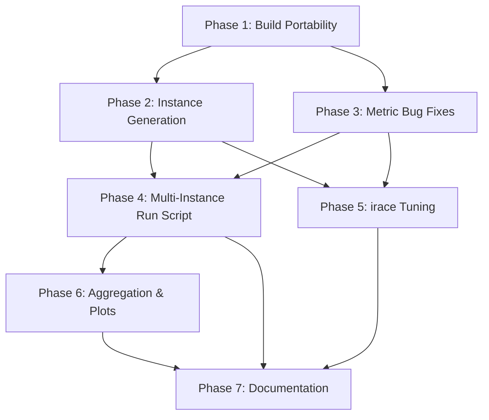

# Revised Plan: Multi-Instance IBOVESPA Experiments for `mopop`

## Goal

Extend `mopop` from its current single-instance setup into a reproducible 10-instance experimentation pipeline (`ibov_2011`–`ibov_2020`), with correct metrics, `irace` tuning, and multi-instance result analysis. Mirror the proven patterns from `motsp_irace`.

---

## Confirmed Bugs and Blockers

### BUG 1 — Hypervolume passes untransformed reference point to pagmo

In [hypervolume_calculator_exec.cpp](file:///home/luishpmendes/mopop/src/exec/hypervolume_calculator_exec.cpp#L34), `compute_hypervolume()` negates the front and builds `reference_point_prime`, but then calls `hv.compute(reference_point)` instead of `hv.compute(reference_point_prime)`. The `motsp_irace` version at [hypervolume_ratio_calculator_exec.cpp:L33](file:///home/luishpmendes/UNICAMP/Doutorado/motsp_irace/src/exec/hypervolume_ratio_calculator_exec.cpp#L33) correctly passes `reference_point_prime`.

**Fix:** Change line 34 to `return hv.compute(reference_point_prime);`

### BUG 2 — Reference point uses max for all objectives (wrong for maximization)

In [reference_pareto_front_and_point_calculator_exec.cpp:L23](file:///home/luishpmendes/mopop/src/exec/reference_pareto_front_and_point_calculator_exec.cpp#L23), the reference point is initialized to `lowest()` and updated via `max(value)` for every objective. For maximization objectives (expected return, Sharpe ratio), the *worst* bound should be the *minimum*, not the maximum. The `motsp_irace` reference avoids this by using `instance.primal_bound` (pre-computed per-instance).

This also silently truncates IGD+. With the reference point holding the *best* value on objectives 0 and 2, `modified_distance` returns `delta = max(0, r[i] − p[i]) = 0` on those dimensions for every reference-front point, so `reference_igd_plus` is built from **2 of the 4 objectives**. Existing IGD+ numbers are structurally wrong, not off by a constant factor.

**Fix:** For MAXIMIZE objectives, track the minimum; for MINIMIZE, track the maximum. Track the opposite bound too, since BUG 3's fix needs the attained range.

### BUG 3 — 5% front perturbation is sign-unsafe

In [reference_pareto_front_and_point_calculator_exec.cpp:L126-134](file:///home/luishpmendes/mopop/src/exec/reference_pareto_front_and_point_calculator_exec.cpp#L126), `mopop` applied a 5% perturbation to the reference front (branching on sense: `*= 0.95` for MIN, `*= 1.05` for MAX). Objectives 0 (expected return) and 2 (ratio) take negative values on daily data, so `*= 1.05` moved a maximization objective *backwards*. It also distorts the empirical reference front geometry, and `plotter_pareto.py` draws that file.

Note that `motsp_irace` has the same perturbation ([reference_pareto_front_calculator_exec.cpp:L126-131](file:///home/luishpmendes/UNICAMP/Doutorado/motsp_irace/src/exec/reference_pareto_front_calculator_exec.cpp#L126), uniform `value *= 0.95`, safe there because all objectives minimize and all TSP costs are positive). It is load-bearing: it makes the reference front strictly dominate every attained point, which keeps HVR and NIGD+ inside `[0, 1]`. Deleting it outright pins HVR at exactly 1.0 for whichever run contributed the front and drops every extreme point to a zero volume contribution.

**Fix:** Remove the perturbation from the *front* and pad the *reference point* outward instead, by 5% of each objective's attained range: `ref[i] = worst[i] ± 0.05 · |best[i] − worst[i]|`. Additive on the range, so it is sign-safe; it fabricates no front points, keeps extreme points contributing positive volume, and keeps both indicators in `[0, 1]`.

### BUG 4 — Downloader docstrings incorrectly say "annualized"

[downloader.py](file:///home/luishpmendes/mopop/downloader.py) computes `returns_df.mean()` and `returns_df.cov()` without annualizing. The docstrings incorrectly say "annualized" but the code computes daily statistics, which is the intended behavior.

**Fix:** Fix the docstrings to say "daily" instead of "annualized". Do not add annualization.

---

## Key Differences from `motsp_irace`

| Aspect | `motsp_irace` | `mopop` (current) | `mopop` (target) |
|---|---|---|---|
| Instance loading | Single `--instance` file | Two files: `--expected-returns-filename` + `--covariance-filename` | Keep two-file approach |
| Objectives | All minimization | Mixed: MAX, MIN, MAX, MIN | Same (4 objectives, mixed) |
| Metric executables | `hypervolume_calculator_exec` (raw, for irace) **and** `hypervolume_ratio_calculator_exec`, `normalized_modified_generational_distance_calculator_exec` | `hypervolume_calculator_exec`, `modified_generational_distance_calculator_exec` | Same three as `motsp_irace`: rename the two, add the raw HV exec |
| HV reference point | `instance.primal_bound`, derived from the instance | Pooled from all runs, `max` for every objective | Pooled worst per sense, padded 5% of range; frozen per instance for irace |
| Metric CLI flags | `--hvr-*`, `--nigd-plus-*` | `--hypervolume-*`, `--igd-plus-*` | Rename to `--hvr-*`, `--nigd-plus-*` |
| Reference front | Separate `reference_pareto_front_calculator_exec` (no point file) | Combined `reference_pareto_front_and_point_calculator_exec` (outputs both front + point) | Keep combined exec, but fix the reference point logic |
| Seeds | 10 seeds | 3 seeds | 10 seeds |
| Hardcoded `4` | Uses `instance.num_objectives` | Hardcoded `4` everywhere | Replace with `instance.senses.size()` |
| irace target runner | Uses raw hypervolume (negated) as cost | N/A | Use raw hypervolume (negated) as cost |
| Directory structure | Flat (`hvr/`, `nigd_plus/`) | Flat (`hypervolume/`, `igd_plus/`) | Instance-prefixed flat (like `motsp_irace`) |

---

## Decisions

| Decision | Value |
|---|---|
| Algorithms | NSGA-II, NSPSO, MOEA/D-DE, MHACO, IHS, NS-BRKGA |
| Seeds | 10 (same as `motsp_irace`: 305089489, 511812191, 608055156, 467424509, 944441939, 414977408, 819312498, 562386085, 287613914, 755772793) |
| Tuning time limit | 60 s |
| Final-run time limit | 3600 s |
| Instances | `ibov_2011`–`ibov_2020` (10 rolling windows) |
| Training window | 5 calendar years |
| OOS window | Following calendar year |
| Ticker source | `ibovespa_tickers_2011_2025/tickers_{year}.csv` |
| Annualization | None (daily statistics) |

---

## Phase 1 — Build Portability and Baseline

**Objective:** Make the build portable and record a deterministic baseline.

### Files to modify

#### [MODIFY] [Makefile](file:///home/luishpmendes/mopop/Makefile)

- Add `make check` target (keep existing hardcoded paths as-is) that runs all tests

#### [NEW] `requirements.txt`

- Pin `yfinance`, `pandas`, `numpy`, `matplotlib`, `seaborn`, `scipy`

#### [NEW] `tests/fixtures/small_instance/`

- Committed 5-asset fixture: `expected_returns.csv`, `covariance_matrix.csv`
- Known deterministic values for smoke testing without network

### Tasks

1. Add `make check` target
2. Create small committed fixture
3. Verify `make clean && make all`
4. Create `requirements.txt`

### Acceptance criteria

- `make clean && make all` compiles
- `make check` passes offline
- Fixture produces deterministic solver output (1 solver, 1 seed, 1s)

---

## Phase 2 — Instance Generation

**Objective:** Generate 10 IBOVESPA instances with training/OOS split and annualized statistics.

### Files to create/modify

#### [NEW] `scripts/generate_instances.py`

- Reads ticker files from `ibovespa_tickers_2011_2025/tickers_{year}.csv`
- Downloads adjusted close prices via `yfinance` for `[train_start, oos_end)` 
- Splits by date into training and OOS
- Computes daily returns, daily expected returns (mean), and daily covariance
- Writes to `instances/ibov_{year}/train/` and `instances/ibov_{year}/oos/`
- Writes `instances/ibov_{year}/metadata.json` with checksums, dates, ticker lists
- Caches raw prices for reproducibility
- Fails by default on insufficient ticker coverage (opt-in `--allow-partial`)

#### [NEW] `scripts/validate_instances.py`

- Validates all 10 instances: non-empty returns, square symmetric covariance, finite values, matching ticker order, no date overlap

#### [MODIFY] [downloader.py](file:///home/luishpmendes/mopop/downloader.py)

- Fix docstrings: change "annualized" to "daily" in `calculate_expected_returns()` and `calculate_covariance_matrix()`

### Instance date table

| Instance | Training | OOS |
|---|---|---|
| `ibov_2011` | `[2011-01-01, 2016-01-01)` | `[2016-01-01, 2017-01-01)` |
| `ibov_2012` | `[2012-01-01, 2017-01-01)` | `[2017-01-01, 2018-01-01)` |
| ... | ... | ... |
| `ibov_2020` | `[2020-01-01, 2025-01-01)` | `[2025-01-01, 2026-01-01)` |

### Output structure

```
instances/ibov_2011/
├── tickers.csv                    (copied from ibovespa_tickers_2011_2025)
├── metadata.json
├── train/
│   ├── expected_returns.csv
│   └── covariance_matrix.csv
└── oos/
    ├── expected_returns.csv
    └── covariance_matrix.csv
```

### Tasks

1. Implement `generate_instances.py` with annualization
2. Implement `validate_instances.py`
3. Generate all 10 instances
4. Verify re-running on cached prices produces identical CSVs

### Acceptance criteria

- All 10 instances pass validation
- Deterministic from cached prices
- Malformed ticker → nonzero exit
- Train/OOS use same ticker order and dimensions

---

## Phase 3 — Metric Bug Fixes and Renaming ✅ DONE

**Objective:** Fix the 4 confirmed bugs, rename executables/flags to match `motsp_irace`, remove hardcoded `4`, and ship the raw-hypervolume executable Phase 5 needs.

### Files modified

#### [MODIFY] `hypervolume_calculator_exec.cpp` → [hypervolume_ratio_calculator_exec.cpp](file:///home/luishpmendes/mopop/src/exec/hypervolume_ratio_calculator_exec.cpp)

- Fixed `hv.compute(reference_point)` → `hv.compute(reference_point_prime)` (BUG 1)
- Replaced all `4` with `instance.senses.size()`
- Renamed CLI flags: `--hypervolume-*` → `--hvr-*`
- Guarded both output loops with `option_exists`, matching `motsp_irace`. Required because `Argument_Parser::option_value` returns `""` for a missing flag, and `ofs.open("")` then throws `File  not created.`
- Empty candidate front returns `0.0` instead of reaching pagmo, which throws on an empty front
- Assert tolerance `<= 1.0 + 1e-9`; `CARGS` carries no `-DNDEBUG`, so an exact comparison aborts real runs on rounding

#### [NEW] [hypervolume_calculator_exec.cpp](file:///home/luishpmendes/mopop/src/exec/hypervolume_calculator_exec.cpp)

Raw hypervolume, mirroring `motsp_irace`'s exec of the same name. Takes `--reference-point` and **no `--reference-pareto`**, which is what makes it usable as an irace cost. `mopop` has no `Instance::primal_bound`, so the point comes from a file.

#### [MODIFY] `modified_generational_distance_calculator_exec.cpp` → [normalized_modified_generational_distance_calculator_exec.cpp](file:///home/luishpmendes/mopop/src/exec/normalized_modified_generational_distance_calculator_exec.cpp)

- Replaced all `4` with `instance.senses.size()`
- Renamed CLI flags: `--igd-plus-*` → `--nigd-plus-*`; fixed the usage string, which advertised a `--instance` flag this exec never accepted
- Empty-front guard before `front.front()`, which was undefined behaviour
- Assert tolerance `<= 1.0 + 1e-9`

The name is a misnomer — the metric is IGD+ — but `motsp_irace` uses the same one and cross-project consistency wins. Thesis text should say IGD+.

#### [MODIFY] [reference_pareto_front_and_point_calculator_exec.cpp](file:///home/luishpmendes/mopop/src/exec/reference_pareto_front_and_point_calculator_exec.cpp)

- Reference point tracks worst *and* best per sense (BUG 2), then pads the worst outward by 5% of the attained range (BUG 3), with fallbacks for a zero range and for an all-zero objective
- Removed the 5% front perturbation; the reference front is written as pooled and nondominated
- Dropped the dead `--hypervolume-*` clauses from the `num_solvers` discovery loop — this exec is never passed them
- Replaced hardcoded `4` with `instance.senses.size()`

#### [MODIFY] [results_aggregator_exec.cpp](file:///home/luishpmendes/mopop/src/exec/results_aggregator_exec.cpp)

- Renamed flags to `--hvr*` / `--nigd-plus*`, matching `motsp_irace` exactly
- Stripped the stray debug prefixes from exception messages (`"A File "` … `"Q File "`)

#### [MODIFY] [Makefile](file:///home/luishpmendes/mopop/Makefile), [run.sh](file:///home/luishpmendes/mopop/run.sh)

- Link rules and phony aliases for all three metric execs; `metrics_test` added to `tests`
- `run.sh` flag sync only — directory renames stay in Phase 4. Also fixed a pre-existing mismatch: `run.sh` passed `--igd-pluses-statistics` while the aggregator read `--igd-plus-statistics`, so the IGD+ statistics file was silently never written

#### [NEW] [src/test/metrics_test.cpp](file:///home/luishpmendes/mopop/src/test/metrics_test.cpp)

The metric formulas live inside exec `main()` translation units and cannot be linked against, so the test mirrors them over an analytic mixed-sense fixture and asserts closed-form values (HV `0.3524`, `reference_igd_plus = (√8.9 + √35.3)/2`), plus the negative-value and zero-range reference point cases. Keep the copies in sync when touching the execs.

### Acceptance criteria — all met

- `make clean && make all` compiles all three metric execs and `metrics_test` passes
- Analytic mixed-sense HVR fixture matches the expected value
- Identical candidate = reference → HVR = 1.0, NIGD+ = 0.0 (verified on real solver output)
- No hardcoded `4` in the metric executables
- Raw HV exec runs with only `--pareto-0` / `--hypervolume-0`, the irace invocation

> [!NOTE]
> The original criterion "`motsp_irace`-compatible output on an all-minimization fixture" was dropped. With a range-padded reference point, `mopop` will not match `motsp_irace`, which uses `instance.primal_bound` and a perturbed front. The analytic fixture is the real check.

### Deliberately out of scope

Hardcoded `4` outside the metric execs — `Instance::is_valid()`, `get_nobj()` in the five pagmo `problem.cpp` files, `Decoder`'s value buffers, `Solution`'s `value(4, 0.0)`. Changing those needs a coordinated pass over all six solvers and their tests.

---

## Phase 4 — Multi-Instance Run Script

**Objective:** Rewrite `run.sh` to loop over instances, using `motsp_irace`'s proven pattern.

### Files to modify/create

#### [MODIFY] [run.sh](file:///home/luishpmendes/mopop/run.sh)

Rewrite to follow [motsp_irace/run.sh](file:///home/luishpmendes/UNICAMP/Doutorado/motsp_irace/run.sh) pattern:

- Add outer `for instance in ${instances[@]}` loop
- Use 10 seeds instead of 3
- Use renamed directories: `hvr/`, `hvr_snapshots/`, `nigd_plus/`, `nigd_plus_snapshots/`
- Use renamed executables and flags
- Use `{instance}_{solver}_{seed}` filename pattern (matching `motsp_irace`)
- Point each instance to its `instances/ibov_{year}/train/` files
- Add `set -euo pipefail`
- Configure `time_limit=3600`, `max_num_solutions=500`, `max_num_snapshots=30`

#### [NEW] `run_smoke.sh`

- Same structure but: 1 instance, 2 seeds, 5s time limit — for quick testing

#### [MODIFY] All plotter scripts

- [plotter_definitions.py](file:///home/luishpmendes/mopop/plotter_definitions.py): add `instances` list, update to 10 seeds, rename `hypervolume` → `hvr` and `igd_plus` → `nigd_plus`
- All `plotter_*.py` files: add instance loop, update directory names

### Key parameters

```bash
instances=(ibov_2011 ibov_2012 ibov_2013 ibov_2014 ibov_2015
           ibov_2016 ibov_2017 ibov_2018 ibov_2019 ibov_2020)
solvers=(nsga2 nspso moead mhaco ihs nsbrkga)
seeds=(305089489 511812191 608055156 467424509 944441939
       414977408 819312498 562386085 287613914 755772793)
time_limit=3600
max_num_solutions=500
max_num_snapshots=30
max_ref_solutions=800
```

### Output structure (matching `motsp_irace` pattern)

```
mopop/
├── statistics/       ibov_2011_nsga2_305089489.txt ...
├── pareto/           ibov_2011_nsga2_305089489.txt, ibov_2011.txt (ref front) ...
├── hvr/              ibov_2011_nsga2_305089489.txt ...
├── hvr_snapshots/    ibov_2011_nsga2_305089489.txt ...
├── nigd_plus/        ibov_2011_nsga2_305089489.txt ...
├── nigd_plus_snapshots/ ...
├── best_solutions_snapshots/ ...
├── num_non_dominated_snapshots/ ...
├── num_fronts_snapshots/ ...
├── num_elites_snapshots/ ...
├── populations_snapshots/ ...
├── metrics/ ...
└── metrics_snapshots/ ...
```

### Tasks

1. Rewrite `run.sh` with instance loop and 10 seeds
2. Update all directory and file naming
3. Update reference front calculator invocation (per instance)
4. Update HVR and NIGD+ calculator invocations (per instance)
5. Update results aggregator invocation (per instance per solver)
6. Create `run_smoke.sh`
7. Update all plotter scripts

### Acceptance criteria

- `run_smoke.sh` completes end-to-end on 1 instance, 2 seeds, 5s
- Output files follow `{instance}_{solver}_{seed}` naming
- Reference front computed per instance (not globally)
- All 6 solvers produce non-empty pareto files

### Runtime estimate

```
10 instances × 6 solvers × 10 seeds × 3600s = 600 runs @ 1hr each
With 6 workers ≈ 100 hours wall-clock
```

---

## Phase 5 — `irace` Parameter Tuning

**Objective:** Set up `irace` workflows for all 6 solvers, following `motsp_irace` patterns.

### Directory structure

```
irace/
├── train-instances.txt         (ibov_2011 through ibov_2017)
├── test-instances.txt          (ibov_2018 through ibov_2020)
├── nsga2-parameters.txt
├── nsga2-scenario.txt
├── nsga2-target-runner.sh
├── nspso-parameters.txt
├── nspso-scenario.txt
├── nspso-target-runner.sh
├── moead-parameters.txt
├── moead-scenario.txt
├── moead-target-runner.sh
├── mhaco-parameters.txt
├── mhaco-scenario.txt
├── mhaco-target-runner.sh
├── ihs-parameters.txt
├── ihs-scenario.txt
├── ihs-target-runner.sh
├── nsbrkga-parameters-stage{1..6}.txt
├── nsbrkga-scenario-stage{1..6}.txt
├── nsbrkga-target-runner.sh
└── irace_runner.sh
```

### Target runner contract (all solvers)

Each `{solver}-target-runner.sh` must:
1. Parse irace args: `$1`=config_id, `$2`=instance_id, `$3`=seed, `$4`=instance_path
2. Map instance path to `instances/{instance}/train/expected_returns.csv` and `covariance_matrix.csv`
3. Run solver for 60s with `--pareto` output to tmpdir
4. Compute raw hypervolume using `hypervolume_calculator_exec` (the Phase 3 raw exec, same approach as `motsp_irace`), passing the instance's **frozen** reference point
5. Print `cost elapsed_time` where `cost = -HV` (negated, since irace minimizes) or `Inf` on failure
6. Clean tmpdir via `trap`

> [!NOTE]
> Both `motsp_irace` and `mopop` use **raw negated hypervolume** (`-HV`) as the irace cost. `hypervolume_calculator_exec` handles mixed-sense objectives by negating maximization objectives internally before computing the hypervolume via pagmo.

> [!IMPORTANT]
> Unlike `motsp_irace`, which derives its reference point from `instance.primal_bound`, `mopop` reads it from a file. Each training instance therefore needs a reference point computed **once** from a pilot pool and then frozen (`instances/ibov_{year}/reference_point.txt`). A point recomputed per candidate would make the cost depend on which configurations happen to be in the pool, so costs would not be comparable across configurations. Because the Phase 3 reference point is padded 5% beyond the pilot pool's attained range, a later run that slightly exceeds the pilot pool still lands inside it rather than making pagmo reject the front.

### Tuning instance split

```
Training:  ibov_2011 through ibov_2017 (7 instances)
Holdout:   ibov_2018 through ibov_2020 (3 instances)
```

### Parameter files

Derive from actual solver CLI options (verified from source):

- **NSGA-II:** `--population-size`, `--crossover-probability`, `--crossover-distribution`, `--mutation-probability`, `--mutation-distribution`
- **NSPSO:** `--population-size`, `--omega`, `--v-coeff`, `--chi`, `--v-max`, `--u-min`, `--u-max`, `--memory`
- **MOEA/D-DE:** `--population-size`, `--weight-generation`, `--decomposition`, `--cr`, `--f`, `--neighbours`, `--preserve-diversity`
- **MHACO:** `--population-size`, `--ker`, `--q`, `--threshold`, `--n-gen-mark`, `--focus`, `--memory`
- **IHS:** `--population-size`, `--phmcr`, `--ppar-min`, `--ppar-max`, `--bw-min`, `--bw-max`
- **NS-BRKGA:** Staged tuning (6 stages, matching `motsp_irace`)

### Tasks

1. Create `train-instances.txt` and `test-instances.txt`
2. Create parameter files for each solver (from actual CLI)
3. Create scenario files for each solver
4. Create target runners for each solver
5. Create NS-BRKGA staged parameter/scenario files
6. Create `irace_runner.sh` orchestrator
7. Build pilot reference fronts for tuning instances

### Acceptance criteria

- Every target runner passes `irace --check`
- 10-experiment smoke test completes for each solver
- stdout contains only `cost elapsed_time`
- Holdout instances untouched during tuning

---

## Phase 6 — Result Aggregation, Statistics, and Plotting

**Objective:** Aggregate multi-instance results, compute statistics, generate publication-quality plots.

### Files to create/modify

#### [NEW] `scripts/aggregate_results.py`

Produce tidy CSVs:
- `summary/runs.csv`: one row per `(instance, solver, seed)` with columns: `instance, solver, seed, hvr, nigd_plus, runtime, num_solutions`
- `summary/snapshots.csv`: one row per snapshot

#### [MODIFY] [metrics_stats.py](file:///home/luishpmendes/mopop/metrics_stats.py) → `scripts/metrics_stats.py`

- Friedman test with `(instance, seed)` as blocks
- Pairwise post-hoc with Holm correction
- Report average ranks and adjusted p-values

#### [MODIFY] All plotter scripts

- Accept instance list parameter
- Generate per-instance and aggregate cross-instance plots
- Rename output directories (`hvr/`, `nigd_plus/`)
- Add algorithm-rank boxplots across instances

### Required plots

1. Per-instance HVR and NIGD+ boxplots (6 solvers)
2. Aggregate rank plots across all 10 instances
3. Convergence curves (median ± IQR) per instance
4. Pareto front plots for best/median runs

### Tasks

1. Implement `aggregate_results.py`
2. Update `metrics_stats.py` for blocked statistical tests
3. Update all plotters for multi-instance
4. Add cross-instance aggregate plots

### Acceptance criteria

- `runs.csv` has exactly `10 × 6 × 10 = 600` rows
- Missing data detected and reported
- All plots generate headlessly
- Statistical output includes sample counts

---

## Phase 7 — Documentation

**Objective:** Complete README and ensure clean-clone reproducibility.

### Files to create/modify

#### [MODIFY] [README.md](file:///home/luishpmendes/mopop/README.md)

Sections:
1. Problem formulation (4 objectives, senses)
2. Dependencies and build (`make all` with configurable paths)
3. Python/R environment setup
4. Instance generation commands
5. Smoke experiment command
6. Final experiment command + runtime estimate
7. HVR and NIGD+ definitions (exact formulas)
8. `irace` tuning procedure
9. Result aggregation and plotting commands
10. Reproducibility notes (Yahoo Finance caveats)

#### [MODIFY] [.gitignore](file:///home/luishpmendes/mopop/.gitignore)

- Add `instances/*/train/`, `instances/*/oos/`, result directories, `bin/`, `venv/`, `__pycache__/`

### Tasks

1. Write complete README
2. Update `.gitignore`
3. Remove stale files (`input/` after migration verified, duplicate plotter)
4. Verify clean-clone smoke execution

### Acceptance criteria

- New user with documented dependencies can run smoke profile from clean clone
- No machine-specific hardcoded paths remain
- `plotter_num_fronts_snapshots copy.py` removed

---

## Dependency Graph



> [!NOTE]
> Phases 2 and 3 can proceed in parallel after Phase 1. Phase 5 (irace) can start as soon as Phases 2+3 are done, in parallel with Phase 4.

---

## What Was Removed from the Original Plan

1. **YAML configuration system** (`config/instances.yaml`, `config/experiments/*.yaml`) — unnecessary complexity; hardcode in shell scripts like `motsp_irace` does
2. **OOS portfolio reevaluation pipeline** (Stage 4 of original) — deferred; can be added later without affecting the core pipeline
3. **`manifest.json` experiment metadata** — premature; use simple log files like `motsp_irace`
4. **Atomic rename / resume / force behavior** — over-engineering for a research pipeline
5. **`results/<experiment_id>/` nested output structure** — use flat directories matching `motsp_irace`
6. **Separate `src/metrics/` library** — keep metric logic in exec files (matches all reference projects)
7. **`scripts/run_experiments.sh` / `scripts/build_reference_fronts.sh` / `scripts/compute_metrics.sh`** — consolidated into single `run.sh` (matches `motsp_irace`)
8. **Training vs OOS scope separation in aggregation** — deferred with OOS evaluation
9. **Speculative features**: training-vs-OOS degradation plots, effect-size measures, compression policies
